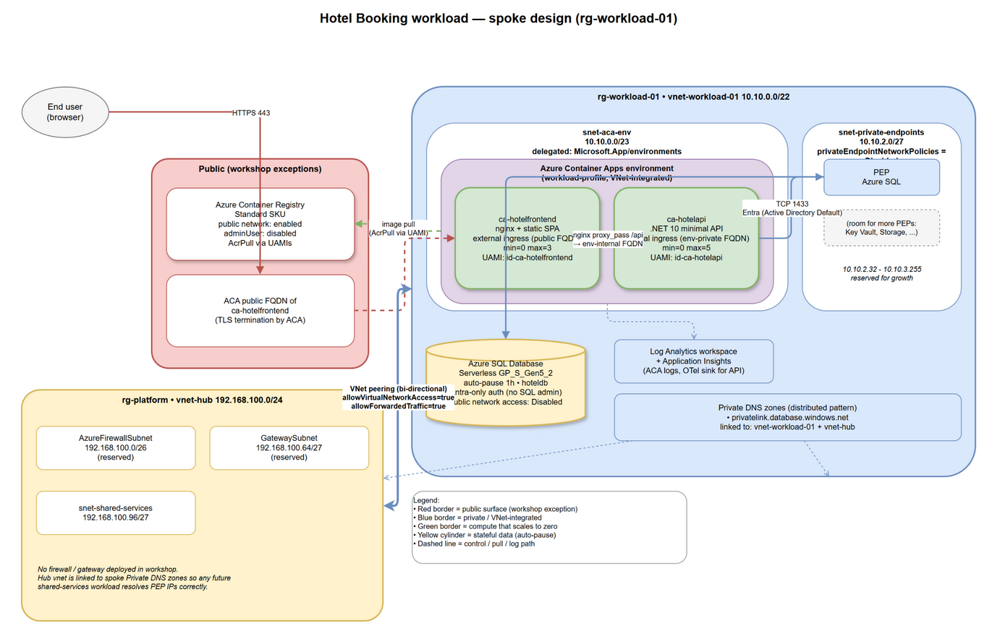

# Chore 2 — Hotel Booking workload: infrastructure design

> **Status:** design only (no IaC). The next chore picks this up and implements it.
> **Scope:** one spoke (`rg-workload-01`) hosting the [workload-app/](../workload-app/) hotel-booking application, peered to the workshop hub from Chore 1.



> The PNG above has the editable draw.io XML embedded — open it in [draw.io desktop](https://www.drawio.com/) or [diagrams.net](https://app.diagrams.net) directly. Source: [diagrams/hotel-booking-architecture.drawio](diagrams/hotel-booking-architecture.drawio).

---

## 1. What the app is (verified against the source)

| Layer | What it is | Source of truth |
| --- | --- | --- |
| Backend | ASP.NET Core 10 **Minimal API**, TFM `net10.0`, EF Core 10 SQL Server provider | [workload-app/backend/HotelBooking.Api/HotelBooking.Api.csproj](../workload-app/backend/HotelBooking.Api/HotelBooking.Api.csproj), [Program.cs](../workload-app/backend/HotelBooking.Api/Program.cs) |
| Frontend | **React 19 + Vite 7 + Tailwind 4** static SPA, no server runtime | [workload-app/frontend/package.json](../workload-app/frontend/package.json), [vite.config.ts](../workload-app/frontend/vite.config.ts) |
| Data | **Azure SQL** (uses EF8+ JSON primitive collections — requires SQL Server 2022+ / Azure SQL DB) | [HotelDbContext.cs](../workload-app/backend/HotelBooking.Api/Data/HotelDbContext.cs) |
| Frontend → API contract | Same-origin, **hard-coded `BASE = '/api'`** | [src/api/client.ts](../workload-app/frontend/src/api/client.ts) |
| Auth | **None** (anonymous everywhere, CORS `AllowAnyOrigin`) | [Program.cs](../workload-app/backend/HotelBooking.Api/Program.cs) |
| External deps (backend) | **Only Azure SQL** + Azure Monitor OpenTelemetry distro (recently added by the app team). No Blob/Queue/Service Bus/Redis/Key Vault/OpenAI references. | grep across `backend/**/*.cs` + [HotelBooking.Api.csproj](../workload-app/backend/HotelBooking.Api/HotelBooking.Api.csproj) |
| Required config | `ConnectionStrings__HotelDb` (the app hard-fails at startup if missing); the inline comment in [appsettings.json](../workload-app/backend/HotelBooking.Api/appsettings.json) prescribes `Authentication=Active Directory Default` → **Entra / managed-identity** auth, no SQL password. Optional: `APPLICATIONINSIGHTS_CONNECTION_STRING` to light up OTel export. | [Program.cs](../workload-app/backend/HotelBooking.Api/Program.cs) |
| Schema lifecycle | `EnsureCreatedAsync` + seed on boot — **no EF migrations**; first-boot identity needs DDL on the database | [DbInitializer.cs](../workload-app/backend/HotelBooking.Api/Data/DbInitializer.cs) |
| Telemetry (frontend) | **OTLP/HTTP-proto** to `${VITE_OTEL_EXPORTER_OTLP_ENDPOINT}/v1/traces` (build-time env, defaults to `/otel`) | [src/telemetry.ts](../workload-app/frontend/src/telemetry.ts) |
| Telemetry (backend) | **Azure Monitor OpenTelemetry distro** (`Azure.Monitor.OpenTelemetry.AspNetCore` 1.5.0) — activated when `APPLICATIONINSIGHTS_CONNECTION_STRING` is set. Includes ASP.NET Core, HttpClient and SqlClient instrumentation. | [Program.cs](../workload-app/backend/HotelBooking.Api/Program.cs) |
| Health probes | **None mapped** (`/healthz`, `/readyz` absent) | [Program.cs](../workload-app/backend/HotelBooking.Api/Program.cs) |

Gaps the platform team accepts but flags (no further app-code changes): no auth, no rate limiting, no health endpoints, no HTTPS redirect, no EF migrations. See §8.

---

## 2. Containerization plan (platform team's responsibility)

Two images, two container apps. **Per [.github/copilot-instructions.md](../.github/copilot-instructions.md) rule 5, every base image comes from `mcr.microsoft.com`, never Docker Hub.**

| Image | Built from | Base images | Listens on |
| --- | --- | --- | --- |
| `hotelapi` | [workload-app/backend/HotelBooking.Api/Dockerfile](../workload-app/backend/HotelBooking.Api/) (to be added) | build: `mcr.microsoft.com/dotnet/sdk:10.0`<br>runtime: `mcr.microsoft.com/dotnet/aspnet:10.0-azurelinux` | `8080` (default container port for .NET 8+) |
| `hotelfrontend` | [workload-app/frontend/Dockerfile](../workload-app/frontend/) (to be added) | build: `mcr.microsoft.com/azurelinux/base/nodejs:22`<br>runtime: `mcr.microsoft.com/azurelinux/base/nginx:1` | `8080` |

`ASPNETCORE_ENVIRONMENT=Production` on the API; nginx config does `try_files $uri /index.html;` for SPA routing and `proxy_pass http://<api-internal-fqdn>/` for `/api/`.

**Why two images and not one** (even though [Program.cs](../workload-app/backend/HotelBooking.Api/Program.cs#L37-L38) is wired to serve the SPA via `UseStaticFiles` + `MapFallbackToFile`):

- Keeps the **API completely off the public internet** (internal ACA ingress). With one image, the same ingress that serves the SPA also exposes `/api/*` publicly — which contradicts the workshop's "private endpoints / private surfaces for everything except the public-facing frontend" rule, because the API would become public *implicitly*.
- Lets the frontend and API **scale independently** (frontend is mostly cacheable static assets, API scales on request rate).
- Re-deploying a CSS tweak doesn't restart the API.
- Both images still pull from the same ACR with image-level RBAC.

The two `Dockerfile`s are added per the workshop's explicit allowance (rule 3); no source files under [workload-app/](../workload-app/) are modified.

---

## 3. Azure footprint

### 3.1 Compute — **Azure Container Apps**

- **One ACA Environment**, *workload-profile* SKU, VNet-integrated into `snet-aca-env` (`/23`, delegated `Microsoft.App/environments` — minimum the workload profile plan requires).
- **`ca-hotelfrontend`** — external ingress, **min replicas = 0**, max = 3, HTTP scale rule (concurrency 50). Public FQDN, TLS terminated by ACA's built-in cert.
- **`ca-hotelapi`** — internal ingress (`external = false`), **min replicas = 0**, max = 5, HTTP scale rule. Resolvable only inside the ACA env on its `<app>.internal.<env>.<region>.azurecontainerapps.io` FQDN. The frontend's nginx proxies `/api/` to that FQDN.
- Both apps use a **user-assigned managed identity** for ACR pull (no admin user on ACR).
- Container Apps consumption profile keeps unused replicas at **zero cost** when idle (cold-start is ~1–3 s for the API; acceptable for a workshop hotel-booking app).

**Why ACA over App Service / AKS / Functions:**
- Native **scale-to-zero** out of the box (App Service has no free scale-to-zero on Linux; AKS would require node-autoscaler + KEDA on top of node cost).
- Built-in VNet integration with subnet delegation — no SNAT pain, no NAT gateway needed for SQL (which is reached via PEP anyway).
- Managed Dapr / health probes / revisions / blue-green out of the box without managing a cluster.
- AKS is overkill — one minimal API + one nginx, no service-mesh requirement.
- Functions doesn't fit a long-lived ASP.NET Minimal API serving an SPA fallback.

### 3.2 Container registry — **Azure Container Registry**

- **Standard SKU** (geo-replication and PEP are Premium-only and not needed for the workshop).
- **Public network access: enabled** — explicit workshop exception so anyone running the build (laptop or GitHub-hosted runner) can `docker push` without a private agent.
- `adminUserEnabled: false`. Pull is via **AcrPull** role assigned to each container app's UAMI; pushes come from the platform engineer or CI principal (`AcrPush`).

### 3.3 Data — **Azure SQL Database (serverless)**

- Logical server `sql-hotelbooking-...`, single database `hoteldb`.
- **GP_S_Gen5_2** (serverless, 2 vCore max), **auto-pause delay = 60 min** — this is the workshop's "scale to zero" for the data tier (compute cost drops to zero when idle; only storage is billed). First request after pause incurs a ~30–60 s warm-up — call this out in the runbook.
- **`publicNetworkAccess: Disabled`**. Reachable only via the **Private Endpoint** in `snet-private-endpoints`.
- **Entra-only authentication** — no SQL admin password. An Entra group (e.g. `sg-sql-hotelbooking-admins`) is set as the AAD admin on the logical server.
- Backend's UAMI (`id-ca-hotelapi`) is created **as a contained database user** in `hoteldb` (`CREATE USER [id-ca-hotelapi] FROM EXTERNAL PROVIDER`) and granted **`db_owner`** initially because [DbInitializer.cs](../workload-app/backend/HotelBooking.Api/Data/DbInitializer.cs) calls `EnsureCreatedAsync`, which needs DDL. **Trade-off:** `db_owner` is broader than ideal — for production we'd add EF migrations and trim the role to `db_datareader + db_datawriter + db_ddladmin` (or just the first two after the first deploy). Documented as a known compromise.
- Connection string at runtime (injected as a secret-less ACA env var):
  ```
  ConnectionStrings__HotelDb = Server=tcp:<sqlserver-fqdn>,1433;Database=hoteldb;Authentication=Active Directory Default;Encrypt=True;TrustServerCertificate=False;Connection Timeout=30;
  ```
  `DefaultAzureCredential` inside the container resolves to the UAMI.

### 3.4 Observability — **Log Analytics + Application Insights**

- One Log Analytics workspace `log-workload-01-...` in `rg-workload-01`.
- ACA environment streams stdout/stderr + system logs into it.
- Application Insights resource (workspace-based) `appi-workload-01-...`. **Connection string is plumbed into `ca-hotelapi` as `APPLICATIONINSIGHTS_CONNECTION_STRING`** — the backend's Azure Monitor OTel distro activates automatically on that env var ([Program.cs](../workload-app/backend/HotelBooking.Api/Program.cs)). Result: end-to-end traces (browser → API → SQL) land in App Insights without any extra exporter wiring.
- Frontend's OTLP traces: simplest workshop path is to point `VITE_OTEL_EXPORTER_OTLP_ENDPOINT` at the **App Insights regional OTLP ingestion endpoint** at build time. *Note:* App Insights OTLP ingest is in preview and CORS may need a small relay; if that's blocking, fall back to leaving frontend traces unconfigured for now.

### 3.5 Identity

| Identity | Type | Permissions |
| --- | --- | --- |
| `id-ca-hotelapi` | User-assigned MI | `AcrPull` on the ACR scope; contained DB user in `hoteldb` (`db_owner` initially, see §3.3 trade-off); used by Azure Monitor distro for telemetry auth if `Credential` is later set |
| `id-ca-hotelfrontend` | User-assigned MI | `AcrPull` on the ACR scope |
| `sg-sql-hotelbooking-admins` | Entra group | Azure SQL AAD admin |
| Deployment principal (platform engineer / CI) | SP or human | `Contributor` on `rg-workload-01`; `AcrPush` on ACR; member of the SQL admin group long enough to create the contained user |

**No Key Vault is required** — there are no app secrets. The only credential (`ConnectionStrings__HotelDb`) is a connection string with no password; the actual auth uses the UAMI. The App Insights connection string is non-secret (instrumentation key only). If Key Vault is added later, it lands on its own PEP in `snet-private-endpoints` with its own `privatelink.vaultcore.azure.net` Private DNS zone.

---

## 4. Networking — spoke layout

Spoke address space: **`10.10.0.0/22`** (assumed from Chore 1; adjust to whatever Chore 1 actually deployed).

| Subnet | Range | Delegation / purpose |
| --- | --- | --- |
| `snet-aca-env` | `10.10.0.0/23` | Delegated `Microsoft.App/environments`. /23 is the minimum for workload-profile ACA. |
| `snet-private-endpoints` | `10.10.2.0/27` | `privateEndpointNetworkPolicies: Disabled`. Hosts the Azure SQL PEP (and any future PEPs — Key Vault, Storage, App Configuration). |
| *(reserved)* | `10.10.2.32 – 10.10.3.255` | Growth: another /27 for a future jump host / build agent / second PEP subnet if Key Vault is added on its own subnet. |

**Does the Chore 1 plan still fit?** Yes, on two conditions:
1. The spoke is sized at least `/23` *just for ACA* — anything smaller forces ACA into its consumption-only profile which has worse private networking. `/22` is the recommended starting size.
2. `snet-private-endpoints` already exists from Chore 1 (it should, since Chore 1 explicitly called it out). If Chore 1 used a different name (e.g. `snet-pe`), keep its name and just confirm `privateEndpointNetworkPolicies` is `Disabled`.

**Peering** (already in place from Chore 1): bi-directional, `allowVirtualNetworkAccess: true`, `allowForwardedTraffic: true`, no gateway transit (hub has no gateway).

### Private DNS zones — **distributed pattern**

Per the workshop's intro, each workload owns its own Private DNS zones, linked back to the hub vnet.

| Zone | Reason | VNet links |
| --- | --- | --- |
| `privatelink.database.windows.net` | Azure SQL PEP | `vnet-workload-01` (registration), `vnet-hub` (resolution) |

ACA's *internal* ingress uses an **auto-managed** Private DNS zone created by the platform service itself (`<env-default-domain>.<region>.azurecontainerapps.io`). That zone is automatically linked to the ACA infrastructure subnet — no manual zone needed.

If we later add Key Vault or Storage PEPs:
- `privatelink.vaultcore.azure.net`
- `privatelink.blob.core.windows.net`

…both following the same distributed link pattern.

### Inbound exposure

- Users hit the **public FQDN of `ca-hotelfrontend`** directly over HTTPS 443. ACA terminates TLS.
- The hub is **not** in the data path for this workshop (no Azure Firewall, no Front Door, no Application Gateway). For production the recommended evolution is **Azure Front Door Standard with WAF** in front (origin = the ACA FQDN, with a custom domain and `X-Azure-FDID` validation) — documented but not deployed here.
- All east-west traffic from the frontend container to the backend container stays inside the ACA environment's mTLS mesh.
- All backend → SQL traffic stays inside the spoke (PEP private IP, resolved via the workload's `privatelink.database.windows.net` zone).
- Egress to ACR for image pulls and to App Insights ingestion leaves the ACA env via the standard SNAT outbound IP — acceptable, since ACR is the public exception and App Insights ingestion is non-secret.

---

## 5. Well-Architected Framework evaluation

### Reliability
- **+** ACA gives automatic revision rollback and health-probe-driven restarts.
- **+** SQL DB serverless includes 7-day PITR by default; geo-redundant backup storage is on by default.
- **−** **No app health endpoints** ([Program.cs](../workload-app/backend/HotelBooking.Api/Program.cs)) — ACA will fall back to a TCP probe on port 8080. The container can be "up" but the DbContext broken and we'd never know. Mitigation: add a `/healthz` endpoint in a follow-up app-team chore.
- **−** **No SQL retry policy** in EF Core config — transient failures will surface as 500s. Same mitigation: a one-line `EnableRetryOnFailure()` in a future app-team change.
- **−** Single-region deployment; cold-start after SQL auto-pause is up to ~60 s. Acceptable for the workshop, documented for ops.

### Security
- **+** No public surface for the API or the database — only the frontend ACA FQDN is reachable.
- **+** No secrets stored anywhere — Entra/MI all the way from container to SQL.
- **+** ACR public but **admin disabled**, pulls are RBAC + MI.
- **+** Base images are **first-party Microsoft images from MCR** ([copilot-instructions.md](../.github/copilot-instructions.md) rule 5) — reduces supply-chain risk vs. arbitrary Docker Hub images.
- **−** **Application has no authentication.** Anyone who hits the public frontend FQDN can `POST /api/bookings` and `DELETE /api/bookings/{id}`. The platform layer can put a WAF in front but it cannot retro-fit auth onto an anonymous API. Documented as a workshop constraint; production must add Entra ID / Easy Auth / API key.
- **−** Backend CORS is `AllowAnyOrigin` — moot in our design (same-origin via nginx proxy), but worth tightening if origins ever split.

### Cost Optimization
- **+** Frontend, backend, **and** database all scale to zero (ACA min=0, SQL auto-pause 60 min) → resting cost ≈ storage + a handful of LA ingestion GBs + ACR Standard (~$0.17/day).
- **+** ACR Standard, not Premium — geo-replication and PEP aren't needed.
- **+** Log Analytics with default 30-day retention; can drop to 7 days if cost matters more than forensics.
- **−** Cold-start latency is the price of scale-to-zero on both compute and data. Acceptable.

### Operational Excellence
- **+** Everything is IaC (next chore), parameter-driven, with AVM modules per [.github/instructions/azure-verified-modules-bicep.instructions.md](../.github/instructions/azure-verified-modules-bicep.instructions.md).
- **+** ACA revisions enable blue-green / canary without extra infra.
- **+** **End-to-end OpenTelemetry** is now in place: the backend's Azure Monitor distro continues the W3C `traceparent` propagated by the frontend's Fetch instrumentation ([telemetry.ts](../workload-app/frontend/src/telemetry.ts)), so a single trace spans browser → API → Azure SQL in App Insights.
- **−** **No `/healthz` endpoint** — ACA falls back to TCP probes until the app team adds it.
- **−** **No EF migrations** — schema evolution requires manual SQL or a redeploy with `EnsureCreated` on a new database. Documented for the app team.

### Performance Efficiency
- **+** Sub-5 s cold start for both containers from cache; warm responses sub-100 ms for the API endpoints (simple EF queries against a small dataset).
- **+** nginx in front of the SPA serves static assets with proper caching headers; the API only handles `/api/*`.
- **+** SQL Serverless auto-scales vCores between min (0.5) and max (2) based on load — no manual tuning needed for workshop traffic.
- **−** Single-region; no CDN in front of the static SPA. If global reach matters, add Front Door (also gives WAF, addressing the Security gap).

---

## 6. Scale-to-zero summary

| Layer | Scales to zero? | How |
| --- | --- | --- |
| Frontend container app | ✅ | ACA `min = 0`, HTTP scale rule |
| Backend container app | ✅ | ACA `min = 0`, HTTP scale rule |
| Azure SQL DB | ✅ (compute only — storage stays billed) | Serverless GP_S, `autoPauseDelay = 60 min` |
| Azure Container Registry | ❌ — fixed Standard SKU cost (~$5/month) | No serverless tier exists. Justification: registry must be reachable for pulls when apps wake. |
| Log Analytics + App Insights | ✅ (pay-as-you-go ingestion; no minimum) | Default pay-per-GB pricing |
| Private endpoints | ❌ — flat per-hour cost (~$7.50/month each) | No way to pause; cost of the private-by-default architecture |
| Private DNS zones | ❌ — but cost is negligible (~$0.50/zone/month) | n/a |

Resting cost when no users hit the app: **ACR Standard + 1× PEP + LA baseline ≈ $15/month**. Active cost scales linearly with traffic — exactly the workshop goal.

---

## 7. Private-endpoint inventory (vs. workshop rule)

| Resource | Private endpoint? | Why |
| --- | --- | --- |
| Azure SQL Database | ✅ Yes | Rule: PEP for all PaaS dependencies |
| Container Apps (backend) | n/a (internal ingress, lives in delegated subnet) | Equivalent: not reachable from internet |
| Container Apps (frontend) | ❌ — public ingress | **Explicit workshop exception:** the public-facing frontend |
| Azure Container Registry | ❌ — public network enabled | **Explicit workshop exception:** anyone-can-push from a laptop |
| Log Analytics / App Insights | ❌ for the workshop | Production would add a Private Link Scope (AMPLS); for the workshop the data-plane ingestion endpoints stay public. Flag as a follow-up. |

---

## 8. Known compromises (handed forward)

1. **No authentication on the API.** Cannot be fixed in the platform layer alone; future app-team chore should add Entra ID auth or Easy Auth in front of the API container.
2. **`EnsureCreated` + `db_owner`** for the API's MI on first boot — replace with EF migrations and trim role to `db_datareader/writer` in a follow-up.
3. **No `/healthz` endpoint** — ACA falls back to TCP probes until the app team adds it.
4. **Application Insights OTLP ingestion is preview** — if it doesn't work for the *frontend* OTLP exporter in the target region, fall back to a self-hosted OTel collector container or accept frontend-trace-less for now. (The backend uses the distro's native Azure Monitor exporter, not OTLP, so it is unaffected.)
5. **AMPLS not configured** — Log Analytics/App Insights data-plane endpoints remain public for the workshop.
6. **`/agent-chat` proxy** in [vite.config.ts](../workload-app/frontend/vite.config.ts#L25) points at a non-existent backend route — ignored for now; if the app team adds an AI feature later, expect a future spoke iteration adding Azure OpenAI behind a PEP.

---

## 9. Resource naming (per [azure-naming.instructions.md](../.github/instructions/azure-naming.instructions.md))

Indicative names (region token `weu`, instance `001`):

| Resource | Name |
| --- | --- |
| Resource group | `rg-workload-01-weu` |
| Virtual network | `vnet-workload-01-weu` |
| ACA environment | `cae-hotelbooking-weu-001` |
| Container app (frontend) | `ca-hotelfrontend-weu-001` |
| Container app (backend) | `ca-hotelapi-weu-001` |
| User-assigned MI (api) | `id-ca-hotelapi-weu-001` |
| User-assigned MI (frontend) | `id-ca-hotelfrontend-weu-001` |
| Container registry | `crhotelbookingweu001` (ACR forbids hyphens) |
| SQL logical server | `sql-hotelbooking-weu-001` |
| SQL database | `sqldb-hoteldb-weu-001` |
| Private endpoint (SQL) | `pep-sql-hotelbooking-weu-001` |
| Log Analytics | `log-workload-01-weu-001` |
| Application Insights | `appi-workload-01-weu-001` |

---

## 10. Hand-off — what the next chore implements

1. AVM-based Bicep for the spoke resources above (compute, data, registry, identities, role assignments, PEP, Private DNS zone + links).
2. The two `Dockerfile`s under [workload-app/backend/HotelBooking.Api/](../workload-app/backend/HotelBooking.Api/) and [workload-app/frontend/](../workload-app/frontend/) — plus an nginx `default.conf` for the frontend image that does SPA fallback and `/api/` reverse-proxy. **All `FROM` lines use `mcr.microsoft.com`** per [copilot-instructions.md](../.github/copilot-instructions.md) rule 5. No source files under `workload-app/` are modified.
3. A small `Deploy-Workload.ps1` (mirroring [mock-alz/Deploy-Hub.ps1](../mock-alz/Deploy-Hub.ps1)) that wraps `az deployment group create` and runs an [`azure-deployment-preflight`](../.github/skills/azure-deployment-preflight/SKILL.md) what-if first.
4. A post-deploy step (one-time) that creates the contained DB users for the two UAMIs in `hoteldb`. This is `sqlcmd` driven and signed in with the platform engineer's Entra identity (which is in the SQL admin group).
