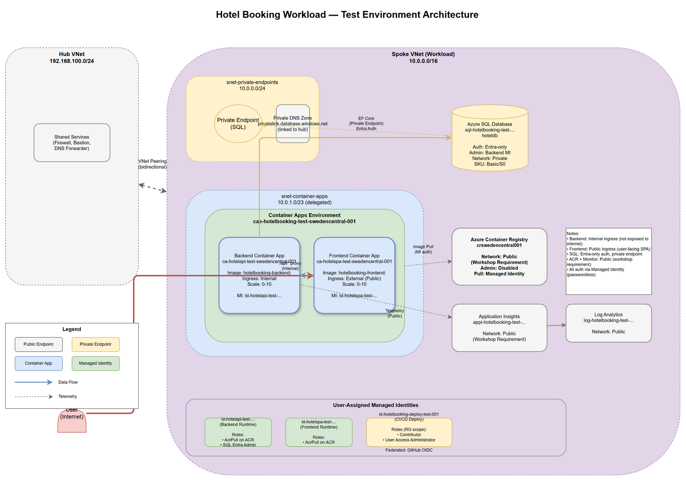

# Hotel Booking Workload — Azure Infrastructure Design (Test Environment)

**Version**: 1.0  
**Environment**: `test`  
**Last Updated**: 2026-06-17

## Executive Summary

This document defines the Azure infrastructure for the Hotel Booking application in the `test` environment. The workload is a containerized .NET 10 API backend with a React SPA frontend, backed by Azure SQL Database. All components follow Azure Well-Architected Framework principles with scale-to-zero capabilities, private networking, and passwordless authentication via managed identities.

## Architecture Diagram



## Application Analysis

### Backend Service
- **Runtime**: .NET 10.0 ASP.NET Core Web API
- **Framework**: Entity Framework Core 10.0
- **Dependencies**:
  - SQL Server database (EF Core migrations)
  - Azure Monitor OpenTelemetry
- **Endpoints**: 
  - `/api/hotels` — hotel search and details
  - `/api/bookings` — booking creation and retrieval
- **Authentication**: Passwordless Azure SQL (Entra managed identity)
- **Configuration**:
  - `ConnectionStrings:HotelDb` — SQL connection string with `Authentication=Active Directory Default`
  - `APPLICATIONINSIGHTS_CONNECTION_STRING` — telemetry ingestion

### Frontend Service
- **Stack**: React 19, TypeScript, Vite 7, Tailwind CSS
- **Build**: Node.js-based static site generation
- **Runtime**: Nginx serving pre-built static assets
- **API Calls**: Fetch to `/api/*` (same-origin, proxied to backend in production)
- **Telemetry**: OpenTelemetry browser instrumentation

### Communication Pattern
- **Production**: Frontend is served as static files from an nginx container; API calls go to `/api/*` and are reverse-proxied to the backend container app's internal endpoint.
- **Separation Rationale**: Backend runs on internal ingress (not exposed to internet); frontend runs on public ingress (user-facing). This limits attack surface while allowing public access to the SPA.

---

## Azure Service Selection

### Container Hosting: Azure Container Apps

**Decision**: Use **Azure Container Apps** for both frontend and backend.

**Rationale**:
| Pillar | Justification |
|--------|--------------|
| **Cost Optimization** | Scale-to-zero in test environment — no usage = no compute charges. Consumption-based billing. |
| **Security Excellence** | Managed identity support, VNET integration, internal ingress for backend, public ingress for frontend, no admin credentials. |
| **Operational Excellence** | Minimal operational overhead — no cluster management, automatic platform updates, built-in ingress controller. |
| **Reliability** | Auto-scaling, health probes, zone redundancy available (not needed for test). |
| **Performance Efficiency** | Right-sized for HTTP workloads; no over-provisioning like AKS. |

**Alternatives Considered**:
- **Azure App Service (Containers)**: No scale-to-zero; always-on billing inappropriate for test environment. Less flexible networking (no internal-only ingress). ❌
- **Azure Kubernetes Service (AKS)**: Massive operational overhead; requires KEDA for scale-to-zero; overkill for two simple container workloads. ❌

### Database: Azure SQL Database

**Decision**: Azure SQL Database (Basic or S0 tier for test).

**Rationale**:
- Application uses SQL Server-specific EF Core provider (`UseSqlServer`).
- Managed PaaS with private endpoint support.
- Entra ID authentication via managed identity (passwordless).
- No migration effort needed.

**Alternatives**: Cosmos DB, PostgreSQL — both would require app changes. ❌

---

## Infrastructure Architecture

### Resource Naming (CAF Conventions)

All resources use the `test` environment token:

| Resource | Name |
|----------|------|
| Resource Group | `rg-hotelbooking-test-swedencentral-001` |
| Container Apps Environment | `cae-hotelbooking-test-swedencentral-001` |
| Backend Container App | `ca-hotelapi-test-swedencentral-001` |
| Frontend Container App | `ca-hotelspa-test-swedencentral-001` |
| SQL Server | `sql-hotelbooking-test-swedencentral-001` |
| SQL Database | `hoteldb` |
| Application Insights | `appi-hotelbooking-test-swedencentral-001` |
| Log Analytics Workspace | `log-hotelbooking-test-swedencentral-001` |
| Container Registry | `crswedencentral001` (shared, no env token) |
| Backend Runtime Identity | `id-hotelapi-test-swedencentral-001` |
| Frontend Runtime Identity | `id-hotelspa-test-swedencentral-001` |
| CI/CD Deploy Identity | `id-hotelbooking-deploy-test-001` |
| SQL Private Endpoint | `pep-sql-hotelbooking-test-001` |
| SQL Private DNS Zone | `privatelink.database.windows.net` |

### Compute

#### Azure Container Apps Environment
- **VNET Integration**: Workload subnet in spoke VNet (`10.0.1.0/23` — infrastructure subnet for Container Apps Environment control plane)
- **Internal**: Yes (all container apps deploy into this internal environment)
- **Zone Redundancy**: Disabled (test environment, cost optimization)
- **Workload Profiles**: Consumption (scale-to-zero enabled)

#### Backend Container App
- **Image**: `crswedencentral001.azurecr.io/hotelbooking-backend:<tag>`
- **Ingress**: Internal only (not exposed to internet; reachable only from frontend and within VNET)
- **Target Port**: 8080 (from Dockerfile `EXPOSE`)
- **Scale Rules**: 
  - Min: 0 (scale-to-zero)
  - Max: 10 (test environment cap)
  - HTTP concurrency: 50 requests/replica
- **Managed Identity**: `id-hotelapi-test-swedencentral-001` (runtime identity)
- **ACR Pull**: Managed identity granted `AcrPull` on registry
- **Environment Variables**:
  - `ConnectionStrings__HotelDb`: `Server=tcp:sql-hotelbooking-test-swedencentral-001.database.windows.net,1433;Database=hoteldb;Authentication=Active Directory Default;Encrypt=True;`
  - `APPLICATIONINSIGHTS_CONNECTION_STRING`: (from App Insights output)
  - `AZURE_CLIENT_ID`: Backend MI client ID (to disambiguate which identity to use)

#### Frontend Container App
- **Image**: `crswedencentral001.azurecr.io/hotelbooking-frontend:<tag>`
- **Ingress**: External (public-facing, user traffic entry point)
- **Target Port**: 80 (nginx default)
- **Scale Rules**:
  - Min: 0 (scale-to-zero)
  - Max: 10
  - HTTP concurrency: 100 requests/replica
- **Managed Identity**: `id-hotelspa-test-swedencentral-001`
- **ACR Pull**: Managed identity granted `AcrPull` on registry
- **Nginx Configuration**: 
  - Serve static files from `/usr/share/nginx/html`
  - Reverse proxy `/api/*` to backend container app internal FQDN (`ca-hotelapi-test-swedencentral-001.internal.<env>.swedencentral.azurecontainerapps.io`)
  - SPA fallback: `try_files $uri /index.html`

### Data

#### Azure SQL Database
- **Server**: `sql-hotelbooking-test-swedencentral-001.database.windows.net`
- **Database**: `hoteldb`
- **SKU**: Basic (5 DTU) or S0 (10 DTU) — test environment, cost-optimized
- **Authentication**: **Microsoft Entra-only** (`azureADOnlyAuthentication: true`)
  - **Entra Admin**: Backend runtime managed identity (`id-hotelapi-test-swedencentral-001`)
  - **Principal Type**: `Application` (required for UAMI)
  - No SQL logins, no passwords
- **Network**: 
  - `publicNetworkAccess: Disabled`
  - **Private Endpoint**: `pep-sql-hotelbooking-test-001` in `snet-private-endpoints` (`10.0.0.0/24`)
  - **Private DNS Zone**: `privatelink.database.windows.net` (in workload RG, linked to hub VNet for DNS resolution)
- **Schema Management**: Backend app runs EF Core migrations on startup (as Entra admin)

### Registry

#### Azure Container Registry
- **Name**: `crswedencentral001` (workshop-shared, **not** per-environment)
- **SKU**: Basic (sufficient for workshop; Premium if geo-replication needed)
- **Admin User**: **Disabled** (managed identity pull only)
- **Network**: **Public endpoint** (workshop requirement — `az acr build` and image pulls need public reachability)
  - **Allow All Networks** — no `ipRules`, no `virtualNetworkRules`, no service-endpoint-only access
  - Reason: ACR Tasks build agents and GitHub Actions runners come from outside the spoke; any network restriction breaks the CI/CD pipeline
- **Role Assignments**: Each runtime identity granted `AcrPull` (scope: registry resource ID)

### Observability

#### Log Analytics Workspace
- **Name**: `log-hotelbooking-test-swedencentral-001`
- **Network**: Public endpoint (workshop requirement — Monitor ingestion over public internet)
- **Retention**: 30 days (test environment)

#### Application Insights
- **Name**: `appi-hotelbooking-test-swedencentral-001`
- **Type**: Workspace-based (linked to Log Analytics)
- **Network**: Public endpoint (workshop requirement)
- **Instrumentation**: 
  - Backend: `Azure.Monitor.OpenTelemetry.AspNetCore` SDK
  - Frontend: `@opentelemetry/sdk-trace-web` browser instrumentation
- **Connection String**: Injected into backend container app environment

### Identity

#### Runtime Managed Identities (User-Assigned)

1. **Backend Runtime Identity** (`id-hotelapi-test-swedencentral-001`)
   - **Purpose**: Backend container app runtime identity
   - **Permissions**:
     - `AcrPull` on ACR (for image pull)
     - SQL Server Entra admin (data-plane owner)
   - **Scope**: ACR resource, SQL Server
   - **Why UAMI**: Role assignments must exist before Container App creation; system-assigned MI `principalId` is unknown until after resource creation.

2. **Frontend Runtime Identity** (`id-hotelspa-test-swedencentral-001`)
   - **Purpose**: Frontend container app runtime identity
   - **Permissions**: 
     - `AcrPull` on ACR (for image pull)
   - **Scope**: ACR resource

#### CI/CD Deploy Identity (User-Assigned)

3. **Deploy Identity** (`id-hotelbooking-deploy-test-001`)
   - **Purpose**: GitHub Actions workflow identity (OIDC federated credential)
   - **Permissions** (scope: `rg-hotelbooking-test-swedencentral-001`):
     - `Contributor` (infrastructure deployment)
     - `User Access Administrator` (grant RBAC to runtime identities)
   - **Separation Rationale (Security)**: CI identity can deploy infrastructure and assign roles but has **no runtime data-plane access** (no SQL, no app secrets). Runtime identities can access data but **cannot redeploy infrastructure**. Blast radius containment.
   - **Federated Credential**: GitHub OIDC subject `repo:azureholic/az-platform-engineering-workshop:environment:test`

### Networking

#### Spoke VNet Extension
The existing spoke VNet (`vnet-workload-test`, `10.0.0.0/16`) is extended with:

| Subnet | Address | Purpose |
|--------|---------|---------|
| `snet-private-endpoints` | `10.0.0.0/24` | Existing subnet for private endpoints (SQL PE lives here) |
| `snet-container-apps` | `10.0.1.0/23` | New subnet for Container Apps Environment infrastructure (delegated to `Microsoft.App/environments`) |

**Justification**: `/23` (512 IPs) is the minimum size for Container Apps Environment infrastructure subnet (per AVM module requirements).

#### Private Endpoints & DNS

**Private Endpoint**:
- `pep-sql-hotelbooking-test-001` → Azure SQL Server private endpoint
- Network interface in `snet-private-endpoints` (`10.0.0.0/24`)

**Private DNS Zones** (distributed model — workload RG owns its zones):
- `privatelink.database.windows.net`
  - A record: `sql-hotelbooking-test-swedencentral-001` → private IP
  - Linked to hub VNet (`vnet-hub`) for DNS resolution from all peered spokes

**Why Not Private for ACR/Monitor**:
- Per [workload-network-exposure.instructions.md](../.github/instructions/workload-network-exposure.instructions.md): ACR and Monitor stack (Log Analytics, Application Insights) **must** stay public for the workshop. Later workshop exercises depend on public reachability for `az acr build` and telemetry ingestion from GitHub-hosted runners.

#### Ingress Flow

```
User (Internet)
  ↓
Frontend Container App (public ingress) :443
  ↓ (nginx reverse proxy /api/*)
Backend Container App (internal ingress) :8080
  ↓ (private endpoint)
Azure SQL Database (private, Entra auth)
```

### Egress & Outbound

- Container apps egress: Routed through Container Apps Environment (no NAT Gateway in test)
- SQL ingress: Private endpoint only (no public access)
- Monitor ingestion: Public endpoint (backend SDK → App Insights over HTTPS)

---

## Security & Compliance

### Passwordless Architecture
- **No secrets** in environment variables, parameters, or outputs
- **No admin credentials** anywhere (no ACR admin user, no SQL logins)
- **Managed identity is the only credential**:
  - Backend authenticates to SQL via Entra (`Authentication=Active Directory Default`)
  - Container apps pull from ACR via managed identity (`registries[].identity`)

### Network Security Posture

| Service | Public/Private | Rationale |
|---------|----------------|-----------|
| Azure SQL | Private | Data plane; no public exposure (Security) |
| Backend Container App | Internal | Not user-facing; attack surface minimization (Security) |
| Frontend Container App | Public | User-facing SPA; must be internet-accessible (Reliability) |
| Container Registry | Public | Workshop requirement (Ops) — `az acr build` + CI/CD compatibility |
| Log Analytics | Public | Workshop requirement (Ops) — Monitor ingestion endpoint reachability |
| Application Insights | Public | Workshop requirement (Ops) — Telemetry ingestion from client browsers |

### RBAC Principle of Least Privilege

| Identity | Role | Scope | Justification |
|----------|------|-------|---------------|
| Backend runtime MI | `AcrPull` | ACR | Image pull only; no push/delete (Security) |
| Backend runtime MI | SQL Entra Admin | SQL Server | Data-plane owner; schema migrations (Ops) |
| Frontend runtime MI | `AcrPull` | ACR | Image pull only |
| CI/CD deploy MI | `Contributor` | Workload RG | Infra deployment; no subscription-wide (Security) |
| CI/CD deploy MI | `User Access Administrator` | Workload RG | Grant RBAC to runtime MIs; scoped to RG (Security) |

**Note**: In production, the SQL Entra admin should be an Entra **group** with the backend MI granted a contained DB user with minimal permissions. The single-MI-as-admin approach is a **documented workshop simplification** to reduce moving parts for learning.

---

## Cost Optimization (Test Environment)

| Decision | Savings Rationale |
|----------|------------------|
| Container Apps scale-to-zero | No usage = $0 compute (nights, weekends) |
| Consumption workload profile | Pay-per-request vs. dedicated plan always-on |
| SQL Basic/S0 tier | ~$5-$15/month vs. $100+ for production tiers |
| Single-region | No geo-replication, no secondary region costs |
| Shared ACR | One registry across all environments (test + prod) |
| No NAT Gateway | Container Apps Environment handles egress (test) |
| No Azure Firewall | Hub firewall not required for spoke-only traffic (test) |

**Estimated monthly cost (test)**: ~$30-50 (mostly SQL + Container Apps Environment base, assuming low usage with scale-to-zero).

---

## Reliability Considerations

| Feature | Test Environment | Production Recommendation |
|---------|------------------|---------------------------|
| Zone redundancy | Disabled (cost) | Enable (multi-AZ) |
| Scale-to-zero | Enabled (cost) | Disable (cold start latency) |
| SQL tier | Basic/S0 | S3+ or Premium (SLA, performance) |
| Replica count | 0-10 | Min 2, max 50+ |
| Health probes | HTTP readiness | Liveness + readiness |
| Geo-redundancy | None | Multi-region active-passive or active-active |

**Test Environment Trade-offs**:
- **Cold start latency**: First request after scale-to-zero takes 2-5 seconds (acceptable for test; not for prod).
- **No HA**: Single region, no zone redundancy (acceptable for test; not for prod).

---

## Operational Excellence

### Monitoring & Alerting
- **Application Insights**: Distributed tracing, request telemetry, dependency tracking
- **Log Analytics**: Container logs, SQL diagnostics
- **Alerts (not in test)**: In production, alert on HTTP 5xx rate, cold start frequency, SQL DTU %.

### Deployment Strategy
- **CI/CD**: GitHub Actions with OIDC (no secrets in repo)
- **Build-once, promote-everywhere**: Single image build in ACR → tagged → deployed to test → promoted to prod (no rebuild)
- **Schema Migrations**: Backend app runs EF Core migrations on startup (idempotent)

### Infrastructure as Code
- **Bicep**: Azure Verified Modules (AVM) for all resources
- **Parameters**: Environment-specific (test vs. prod) via `.bicepparam` files
- **Secrets**: None — all auth via managed identity

---

## Design Validation Checklist

✅ **Compute**: Azure Container Apps chosen with documented rationale vs. alternatives  
✅ **Database**: Azure SQL with private endpoint + Entra-only auth  
✅ **Registry**: Public ACR (workshop requirement), admin user disabled, MI pull  
✅ **Observability**: App Insights + Log Analytics (public endpoints per workshop rules)  
✅ **Identity**: Three separate UAMIs (backend runtime, frontend runtime, CI/CD deploy)  
✅ **Networking**: Private endpoints for SQL, internal ingress for backend, public for frontend  
✅ **Naming**: All resources use `test` environment token per CAF  
✅ **Security**: No secrets, passwordless, least-privilege RBAC  
✅ **Cost**: Scale-to-zero, Basic SQL tier, Consumption plan  
✅ **Decisions**: Every major choice has rationale tied to WAF pillar  

---

## Next Steps

A follow-up implementation will:
1. Author Bicep modules using AVM for all resources above
2. Create Dockerfiles for backend (.NET 10 multi-stage) and frontend (Node build + nginx runtime)
3. Deploy infrastructure to Azure with `./Deploy-Workload.ps1`
4. Build and push container images to ACR
5. Roll out tagged images to container apps
6. Validate end-to-end: public frontend → internal backend API → private SQL

---

## Appendix: Decision Log

| Decision | Rationale | Alternatives | Pillar |
|----------|-----------|--------------|--------|
| Azure Container Apps | Scale-to-zero, managed identity, internal + public ingress, low ops overhead | App Service (no scale-to-zero), AKS (high ops) | Cost, Ops, Security |
| Internal ingress for backend | Attack surface minimization; not user-facing | Public ingress (exposes API to internet) | Security |
| Public ingress for frontend | User-facing SPA; must be internet-accessible | CDN/Front Door (overkill for test) | Reliability |
| Entra-only SQL auth | Passwordless, no secrets | SQL logins (secrets in Key Vault or config) | Security |
| SQL private endpoint | Data plane isolation | Public with firewall rules (higher risk) | Security |
| Public ACR | Workshop requirement (CI/CD compatibility) | Private endpoint (breaks `az acr build`) | Ops |
| Shared ACR (no env token) | Build-once, promote-everywhere | Per-env ACR (violates workshop pattern) | Ops, Cost |
| Three separate UAMIs | Least privilege; CI ≠ runtime; backend ≠ frontend | Single MI for all (blast radius) | Security |
| Distributed Private DNS model | Workload owns its zones; scales to multi-tenant | Centralized DNS in hub (tight coupling) | Ops |
| SQL Basic tier (test) | Cost optimization | S3/Premium (unnecessary for test load) | Cost |
| No NAT Gateway (test) | Cost optimization | NAT Gateway (static egress IP) | Cost |

---

**Document Status**: Ready for implementation  
**Reviewer Sign-off**: Pending
