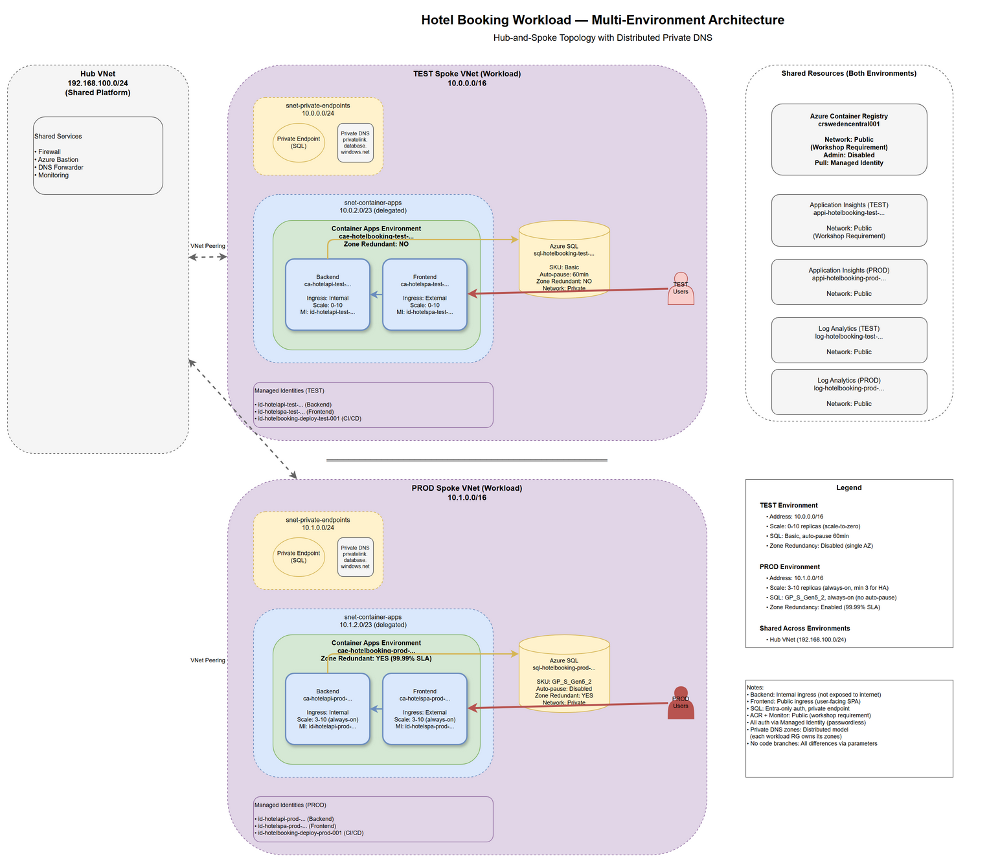

# Hotel Booking Workload — Azure Infrastructure Design

**Version**: 2.0  
**Environments**: `test`, `prod`  
**Last Updated**: 2026-06-17

## Executive Summary

This document defines the Azure infrastructure for the Hotel Booking application across **test** and **prod** environments. The workload is a containerized .NET 10 API backend with a React SPA frontend, backed by Azure SQL Database. All components follow Azure Well-Architected Framework principles with environment-specific configurations: test optimizes for cost (scale-to-zero), prod optimizes for reliability (zone redundancy, minimum replicas).

## Multi-Environment Strategy

### Design Principles

1. **One Template, Many Environments**: Single Bicep template (`main.bicep`) with environment-specific parameter files (`main.test.bicepparam`, `main.prod.bicepparam`)
2. **Network Isolation**: Separate spoke VNets per environment with non-overlapping address spaces
3. **Distributed Private DNS**: Each environment owns its Private DNS zones, linked to hub for resolution
4. **Zero Code Branches**: No `if (environmentName == 'prod')` logic in Bicep — all differences expressed as parameter values
5. **Idempotent Deployments**: Test remains byte-for-byte unchanged when introducing prod

### Environment Comparison

| Aspect | Test | Prod |
|--------|------|------|
| **Purpose** | Development, validation, cost optimization | Production workloads, high availability |
| **Spoke VNet** | 10.0.0.0/16 | 10.1.0.0/16 |
| **Private Endpoint Subnet** | 10.0.0.0/24 | 10.1.0.0/24 |
| **Container Apps Subnet** | 10.0.2.0/23 | 10.1.2.0/23 |
| **Container Replicas** | min=0 (scale-to-zero), max=3 | min=3 (always-on), max=10 |
| **Zone Redundancy** | Disabled | **Enabled** (ACA Environment + SQL) |
| **SQL SKU** | GP_S_Gen5_1 (serverless, auto-pause) | GP_S_Gen5_2 or BC_Gen5_2 (always-on) |
| **SQL Auto-Pause** | 60 minutes | Disabled (-1) |
| **Monthly Cost Estimate** | ~$30-50 (scale-to-zero savings) | ~$200-300 (HA premium) |

---

## Architecture Diagram



---

## Application Analysis

### Backend Service
- **Runtime**: .NET 10.0 ASP.NET Core Web API
- **Framework**: Entity Framework Core 10.0
- **Dependencies**:
  - SQL Server database (EF Core migrations)
  - Azure Monitor OpenTelemetry
- **Endpoints**: 
  - `/api/hotels` — hotel search and details
  - `/api/bookings` — booking creation and retrieval
- **Authentication**: Passwordless Azure SQL (Entra managed identity)
- **Configuration**:
  - `ConnectionStrings:HotelDb` — SQL connection string with `Authentication=Active Directory Default`
  - `APPLICATIONINSIGHTS_CONNECTION_STRING` — telemetry ingestion

### Frontend Service
- **Stack**: React 19, TypeScript, Vite 7, Tailwind CSS
- **Build**: Node.js-based static site generation
- **Runtime**: Nginx serving pre-built static assets
- **API Calls**: Fetch to `/api/*` (same-origin, proxied to backend in production)
- **Telemetry**: OpenTelemetry browser instrumentation

### Communication Pattern
- **Production**: Frontend is served as static files from an nginx container; API calls go to `/api/*` and are reverse-proxied to the backend container app's internal endpoint.
- **Separation Rationale**: Backend runs on internal ingress (not exposed to internet); frontend runs on public ingress (user-facing). This limits attack surface while allowing public access to the SPA.

---

## Azure Service Selection

### Container Hosting: Azure Container Apps

**Decision**: Use **Azure Container Apps** for both frontend and backend across both environments.

**Rationale**:
| Pillar | Test Justification | Prod Justification |
|--------|-------------------|-------------------|
| **Cost Optimization** | Scale-to-zero — no usage = no compute charges | Right-sized for HTTP workloads; no Kubernetes overhead |
| **Reliability** | Auto-scaling, health probes | Zone redundancy, minimum 3 replicas, multi-AZ spread |
| **Security Excellence** | Managed identity, VNET integration, internal/public ingress separation | Same + production-grade network policies |
| **Operational Excellence** | Minimal overhead, automatic updates | Same + proven at scale |
| **Performance Efficiency** | Consumption profile | Consumption profile with higher concurrency limits |

**Alternatives Considered**:
- **Azure App Service (Containers)**: No scale-to-zero; always-on billing inappropriate for test. ❌
- **Azure Kubernetes Service (AKS)**: Massive operational overhead; requires KEDA for scale-to-zero; overkill for two containers. ❌

### Database: Azure SQL Database

**Decision**: Azure SQL Database with environment-specific SKUs.

**Rationale**:
- Application uses SQL Server-specific EF Core provider (`UseSqlServer`)
- Managed PaaS with private endpoint support
- Entra ID authentication via managed identity (passwordless)
- **Test**: Serverless SKU with auto-pause (cost optimization)
- **Prod**: Provisioned SKU with zone redundancy (reliability)

**Alternatives**: Cosmos DB, PostgreSQL — both would require app changes. ❌

---

## Infrastructure Architecture

### Resource Naming (CAF Conventions)

#### Test Environment Resources

| Resource | Name |
|----------|------|
| Resource Group | `rg-hotelbooking-test-swedencentral-001` |
| Spoke VNet | `vnet-workload-test` |
| Container Apps Environment | `cae-hotelbooking-test-swedencentral-001` |
| Backend Container App | `ca-hotelapi-test-swc-001` (24 chars, region code for length) |
| Frontend Container App | `ca-hotelspa-test-swc-001` (24 chars) |
| SQL Server | `sql-hotelbooking-test-swedencentral-<unique>` |
| SQL Database | `hoteldb` |
| Application Insights | `appi-hotelbooking-test-swedencentral-001` |
| Log Analytics Workspace | `log-hotelbooking-test-swedencentral-001` |
| Backend Runtime Identity | `id-hotelapi-test-swedencentral-001` |
| Frontend Runtime Identity | `id-hotelspa-test-swedencentral-001` |
| CI/CD Deploy Identity | `id-hotelbooking-deploy-test-001` |
| SQL Private Endpoint | `pep-sql-hotelbooking-test-001` |
| SQL Private DNS Zone | `privatelink.database.windows.net` (in test RG) |

#### Prod Environment Resources

| Resource | Name |
|----------|------|
| Resource Group | `rg-hotelbooking-prod-swedencentral-001` |
| Spoke VNet | `vnet-workload-prod` |
| Container Apps Environment | `cae-hotelbooking-prod-swedencentral-001` |
| Backend Container App | `ca-hotelapi-prod-swc-001` |
| Frontend Container App | `ca-hotelspa-prod-swc-001` |
| SQL Server | `sql-hotelbooking-prod-swedencentral-<unique>` |
| SQL Database | `hoteldb` |
| Application Insights | `appi-hotelbooking-prod-swedencentral-001` |
| Log Analytics Workspace | `log-hotelbooking-prod-swedencentral-001` |
| Backend Runtime Identity | `id-hotelapi-prod-swedencentral-001` |
| Frontend Runtime Identity | `id-hotelspa-prod-swedencentral-001` |
| CI/CD Deploy Identity | `id-hotelbooking-deploy-prod-001` |
| SQL Private Endpoint | `pep-sql-hotelbooking-prod-001` |
| SQL Private DNS Zone | `privatelink.database.windows.net` (in prod RG, isolated from test) |

#### Shared Resources

| Resource | Name | Notes |
|----------|------|-------|
| Container Registry | `crswedencentral001` | Shared across all environments |
| Hub VNet | `vnet-hub` | Shared platform infrastructure (in `rg-platform`) |

---

## Compute Architecture

### Azure Container Apps Environment

#### Test Configuration
- **VNET Integration**: Workload subnet `10.0.2.0/23` (512 IPs for infrastructure)
- **Internal**: No (allows external ingress for frontend)
- **Public Network Access**: Enabled
- **Zone Redundancy**: **Disabled** (cost optimization)
- **Workload Profiles**: Consumption only (scale-to-zero)

#### Prod Configuration
- **VNET Integration**: Workload subnet `10.1.2.0/23`
- **Internal**: No
- **Public Network Access**: Enabled
- **Zone Redundancy**: **Enabled** (requires region with 3 AZs, e.g., swedencentral)
- **Workload Profiles**: Consumption (with higher min replicas)

### Backend Container App

#### Common Configuration (Both Environments)
- **Image**: `crswedencentral001.azurecr.io/hotelbooking-backend:<tag>`
- **Ingress**: Internal only (not internet-exposed)
- **Target Port**: 8080
- **Managed Identity**: Environment-specific UAMI with AcrPull role
- **Environment Variables**:
  - `ConnectionStrings__HotelDb`: `Server=tcp:<sql-server>.database.windows.net,1433;Database=hoteldb;Authentication=Active Directory Default;Encrypt=True;`
  - `APPLICATIONINSIGHTS_CONNECTION_STRING`: From App Insights output
  - `AZURE_CLIENT_ID`: Backend MI client ID

#### Test-Specific Scaling
- Min: **0** (scale-to-zero)
- Max: 3
- HTTP concurrency: 50 requests/replica

#### Prod-Specific Scaling
- Min: **3** (always-on, zone spread)
- Max: 10
- HTTP concurrency: 50 requests/replica

### Frontend Container App

#### Common Configuration
- **Image**: `crswedencentral001.azurecr.io/hotelbooking-frontend:<tag>`
- **Ingress**: External (public-facing)
- **Target Port**: 80
- **Managed Identity**: Environment-specific UAMI with AcrPull role
- **Nginx Configuration**:
  - Serve static files from `/usr/share/nginx/html`
  - Reverse proxy `/api/*` to backend internal FQDN
  - SPA fallback: `try_files $uri /index.html`

#### Test-Specific Scaling
- Min: **0**
- Max: 3
- HTTP concurrency: 100 requests/replica

#### Prod-Specific Scaling
- Min: **3**
- Max: 10
- HTTP concurrency: 100 requests/replica

---

## Data Architecture

### Azure SQL Database

#### Common Configuration
- **Database**: `hoteldb`
- **Authentication**: **Microsoft Entra-only** (`azureADOnlyAuthentication: true`)
  - **Entra Admin**: Backend runtime managed identity (per environment)
  - **Principal Type**: `Application` (required for UAMI)
  - No SQL logins, no passwords
- **Network**: 
  - `publicNetworkAccess: Disabled`
  - Private Endpoint in `snet-private-endpoints`
  - Private DNS Zone `privatelink.database.windows.net` (per-environment, linked to hub)

#### Test Configuration
- **SKU**: `GP_S_Gen5_1` (General Purpose Serverless, 1 vCore, 3 GB RAM)
- **Auto-Pause Delay**: 60 minutes (cost optimization)
- **Zone Redundancy**: Disabled
- **Estimated Cost**: ~$10-15/month (with auto-pause)

#### Prod Configuration
- **SKU**: `GP_S_Gen5_2` or `BC_Gen5_2` (Business Critical for mission-critical)
- **Auto-Pause Delay**: **-1 (disabled)** — always-on
- **Zone Redundancy**: **Enabled** (synchronous replication across 3 AZs)
- **Estimated Cost**: ~$100-200/month (provisioned, zone-redundant)

---

## Registry & Observability

### Azure Container Registry

**Configuration** (shared across environments):
- **Name**: `crswedencentral001`
- **SKU**: Basic (sufficient for workshop; Premium for prod geo-replication if needed)
- **Admin User**: **Disabled** (managed identity pull only)
- **Network**: **Public endpoint** (workshop requirement)
  - **Allow All Networks** — no `ipRules`, no `virtualNetworkRules`
  - Reason: ACR Tasks and GitHub Actions runners need public reachability
- **Role Assignments**: Each environment's runtime identities granted `AcrPull`

### Log Analytics Workspace

**Per-Environment Configuration**:
- **Test**: `log-hotelbooking-test-swedencentral-001`, 30-day retention
- **Prod**: `log-hotelbooking-prod-swedencentral-001`, 90-day retention
- **Network**: Public endpoint (workshop requirement for Monitor ingestion)

### Application Insights

**Per-Environment Configuration**:
- **Test**: `appi-hotelbooking-test-swedencentral-001`
- **Prod**: `appi-hotelbooking-prod-swedencentral-001`
- **Type**: Workspace-based (linked to env-specific Log Analytics)
- **Network**: Public endpoint (workshop requirement)
- **Instrumentation**: Backend uses `Azure.Monitor.OpenTelemetry.AspNetCore`, frontend uses `@opentelemetry/sdk-trace-web`

---

## Identity & Access Management

### Runtime Managed Identities (User-Assigned, Per Environment)

#### Backend Runtime Identity
- **Name Pattern**: `id-hotelapi-<env>-swedencentral-001`
- **Permissions**:
  - `AcrPull` on shared ACR
  - SQL Server Entra admin (data-plane owner for schema migrations)
- **Scope**: ACR resource, SQL Server (per environment)
- **Why UAMI**: Role assignments must exist before Container App creation

#### Frontend Runtime Identity
- **Name Pattern**: `id-hotelspa-<env>-swedencentral-001`
- **Permissions**: `AcrPull` on shared ACR
- **Scope**: ACR resource

### CI/CD Deploy Identity (User-Assigned, Per Environment)

**Name Pattern**: `id-hotelbooking-deploy-<env>-001`

**Permissions** (scoped to environment-specific workload RG):
- `Contributor` — infrastructure deployment
- `User Access Administrator` — grant RBAC to runtime identities

**Separation Rationale**: CI identity deploys infrastructure but has **no runtime data-plane access**. Runtime identities access data but **cannot redeploy infrastructure**. Blast radius containment.

**Federated Credential** (for GitHub Actions OIDC):
- **Subject**: `repo:azureholic/az-platform-engineering-workshop:environment:<env>`
- **Issuer**: `https://token.actions.githubusercontent.com`

---

## Network Architecture

### Topology Overview

```
Hub VNet (rg-platform, 192.168.100.0/24)
├── Peering → Test Spoke (10.0.0.0/16)
└── Peering → Prod Spoke (10.1.0.0/16)
```

### Test Spoke VNet

| Subnet | Address | Purpose |
|--------|---------|---------|
| `snet-private-endpoints` | `10.0.0.0/24` | Private endpoints (SQL, future services) |
| `snet-container-apps` | `10.0.2.0/23` | Container Apps Environment infrastructure (delegated to `Microsoft.App/environments`) |

### Prod Spoke VNet

| Subnet | Address | Purpose |
|--------|---------|---------|
| `snet-private-endpoints` | `10.1.0.0/24` | Private endpoints (SQL) |
| `snet-container-apps` | `10.1.2.0/23` | Container Apps Environment infrastructure |

### Private DNS Architecture (Distributed Model)

Each environment owns its Private DNS zones, linked to hub for cross-spoke resolution:

#### Test Private DNS
- **Zone**: `privatelink.database.windows.net` (in `rg-hotelbooking-test-swedencentral-001`)
- **A Record**: `sql-hotelbooking-test-swedencentral-<unique>` → private IP
- **VNet Links**: 
  - `vnet-workload-test` (registration enabled)
  - `vnet-hub` (resolution only)

#### Prod Private DNS
- **Zone**: `privatelink.database.windows.net` (in `rg-hotelbooking-prod-swedencentral-001`)
- **A Record**: `sql-hotelbooking-prod-swedencentral-<unique>` → private IP
- **VNet Links**:
  - `vnet-workload-prod` (registration enabled)
  - `vnet-hub` (resolution only)

**Isolation**: Test and prod SQL servers resolve to different private IPs via separate DNS zones. No cross-environment name collision.

### Network Security Posture

| Service | Public/Private | Rationale |
|---------|----------------|-----------|
| Azure SQL | Private | Data plane; no public exposure (Security) |
| Backend Container App | Internal | Not user-facing; attack surface minimization (Security) |
| Frontend Container App | Public | User-facing SPA; must be internet-accessible (Reliability) |
| Container Registry | Public | Workshop requirement (Ops) — ACR Tasks + CI/CD compatibility |
| Log Analytics | Public | Workshop requirement (Ops) — Monitor ingestion endpoint reachability |
| Application Insights | Public | Workshop requirement (Ops) — Telemetry ingestion from browsers |

### Ingress Flow (Both Environments)

```
User (Internet)
  ↓
Frontend Container App (public ingress) :443
  ↓ (nginx reverse proxy /api/*)
Backend Container App (internal ingress) :8080
  ↓ (private endpoint)
Azure SQL Database (private, Entra auth)
```

---

## Security & Compliance

### Passwordless Architecture

- **No secrets** in environment variables, parameters, or outputs
- **No admin credentials** anywhere (no ACR admin user, no SQL logins)
- **Managed identity is the only credential**:
  - Backend authenticates to SQL via Entra (`Authentication=Active Directory Default`)
  - Container apps pull from ACR via managed identity

### RBAC Principle of Least Privilege

| Identity | Role | Scope | Justification |
|----------|------|-------|---------------|
| Backend runtime MI (per env) | `AcrPull` | Shared ACR | Image pull only; no push/delete |
| Backend runtime MI | SQL Entra Admin | SQL Server (per env) | Data-plane owner; schema migrations |
| Frontend runtime MI (per env) | `AcrPull` | Shared ACR | Image pull only |
| CI/CD deploy MI (per env) | `Contributor` | Workload RG (per env) | Infra deployment; no subscription-wide |
| CI/CD deploy MI | `User Access Administrator` | Workload RG (per env) | Grant RBAC to runtime MIs; scoped to RG |

---

## Cost Optimization

### Test Environment Strategy

| Decision | Savings Rationale |
|----------|------------------|
| Scale-to-zero | No usage = $0 compute (nights, weekends) |
| Consumption profile | Pay-per-request vs. dedicated plan |
| SQL Serverless + auto-pause | ~$10/month vs. $100+ for provisioned |
| Single-region | No geo-replication costs |
| No zone redundancy | ~30% savings on compute/SQL |
| Shared ACR | One registry across all environments |

**Estimated Monthly Cost**: **~$30-50**

### Prod Environment Strategy

| Decision | Reliability Benefit | Cost Impact |
|----------|---------------------|-------------|
| Min 3 replicas | Zero cold starts, instant scale-out | +$50-100/month |
| Zone redundancy (ACA + SQL) | Survive AZ failures | +$100-150/month |
| Always-on SQL | No startup delays | +$50-100/month |
| 90-day Log Analytics retention | Compliance, audit trail | +$10-20/month |

**Estimated Monthly Cost**: **~$200-300**

---

## Reliability (Production)

### High Availability

| Component | Mechanism | SLA |
|-----------|-----------|-----|
| Container Apps | 3+ replicas across 3 AZs, automatic failover | 99.95% |
| Azure SQL | Zone-redundant, synchronous replication | 99.995% |
| ACR | Geo-replication (if Premium SKU) | 99.95% |
| VNet | Zone-redundant by default | 99.99% |

### Disaster Recovery

- **Backup**: Azure SQL automated backups (7 days point-in-time, 35 days long-term)
- **Restore**: `az sql db restore` to new server
- **Container Images**: Immutable, stored in ACR with retention policy
- **Infrastructure**: Bicep templates in Git (infrastructure as code)

---

## Deployment Strategy

### Parameter-Driven Deployment

```powershell
# Deploy test environment
az deployment group create `
  --resource-group rg-hotelbooking-test-swedencentral-001 `
  --parameters infra/workload/main.test.bicepparam

# Deploy prod environment
az deployment group create `
  --resource-group rg-hotelbooking-prod-swedencentral-001 `
  --parameters infra/workload/main.prod.bicepparam
```

### Idempotency Verification

Before deploying prod, verify test remains unchanged:

```powershell
az deployment group what-if `
  --resource-group rg-hotelbooking-test-swedencentral-001 `
  --parameters infra/workload/main.test.bicepparam

# Expected: 0 create/delete operations (only cosmetic property updates)
```

---

## Decision Log

| Date | Decision | Rationale |
|------|----------|-----------|
| 2026-06-17 | Multi-environment with parameter files | Zero code branches, idempotent deployments |
| 2026-06-17 | Separate spokes (10.0.0.0/16 test, 10.1.0.0/16 prod) | Network isolation, no address overlap |
| 2026-06-17 | Distributed Private DNS per environment | Zone ownership, no cross-environment name collision |
| 2026-06-17 | Zone redundancy in prod only | Cost optimization in test, reliability in prod |
| 2026-06-17 | Shared ACR across environments | Cost optimization, single source of truth for images |
| 2026-06-17 | Serverless SQL in test, provisioned in prod | Auto-pause savings vs. always-on reliability |

---

## References

- [Azure Container Apps documentation](https://learn.microsoft.com/azure/container-apps/)
- [Azure SQL Database documentation](https://learn.microsoft.com/azure/azure-sql/database/)
- [Azure Well-Architected Framework](https://learn.microsoft.com/azure/well-architected/)
- [Microsoft CAF Naming Conventions](https://learn.microsoft.com/azure/cloud-adoption-framework/ready/azure-best-practices/resource-naming)
- [Azure Verified Modules (AVM)](https://aka.ms/avm)
